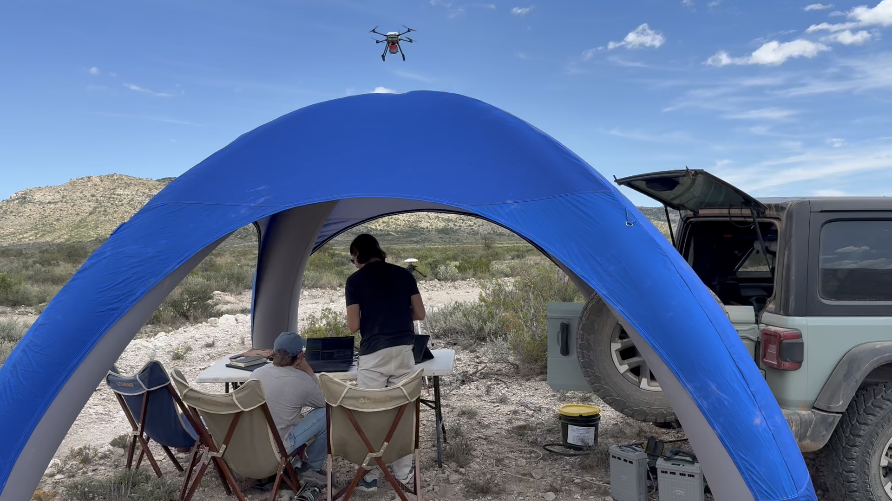
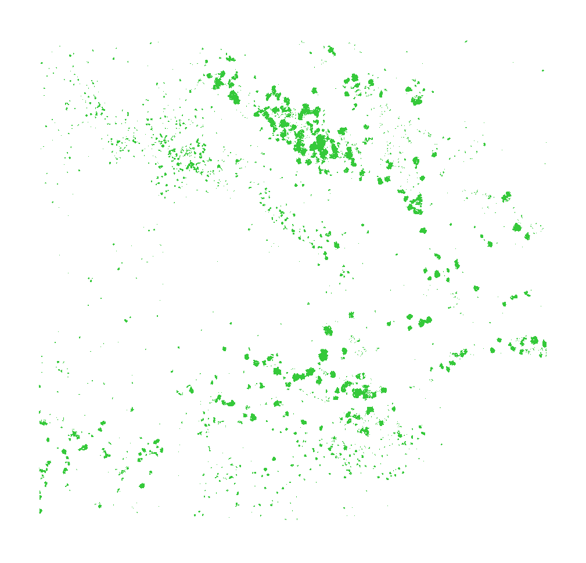
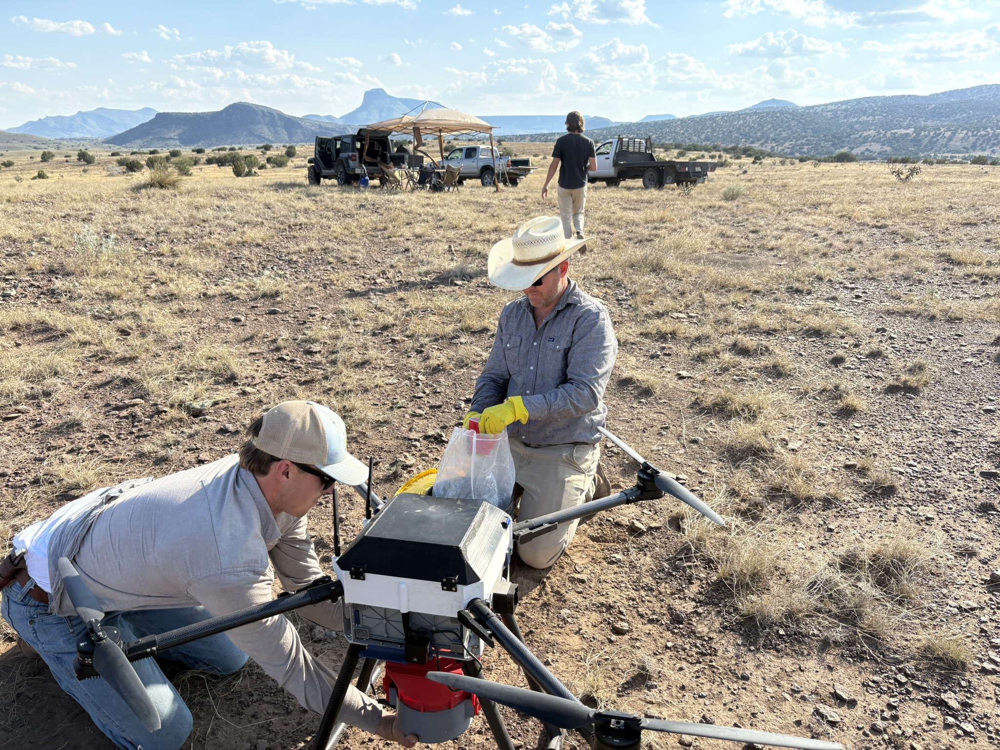

Most of the ranches we work on came to us through someone the owner already listened to: the biologist who wrote the wildlife plan, the broker who sold the place, the county agent who ran the field day. This page is for you. It's written so you can decide whether we're worth mentioning, and so you can explain us accurately without having to call us first.

## If you remember one sentence

We map a ranch from the air down to the individual plant, sorted by species, and mark the trees that should be left alone. Everything below is detail you can reach for if someone asks a follow-up.

## The thirty-second version

Three lines you can actually say out loud:

- "There's an outfit in Fort Davis that flies drones and maps brush."
- "You get a count and a map of the mesquite and cedar on the place, plant by plant, not an acreage guess."
- "They mark the trees you want kept, so the treatment works around them."

## What we do, in one paragraph

We map first and treat second. A drone survey photographs a ranch down to the centimeter, our detection models find and count the mesquite and cedar on it plant by plant, and treatment is targeted from the air one plant at a time. No scraped pastures, no guessing at density from the truck window. The owner gets a plant count, a density map, a high-resolution picture of the whole place, and a firm quote from the survey.

_A survey under way. The aircraft flies the pasture on a grid; the crew and the ground equipment stay put until it's done._

## Start with the free ballpark

Type a client's ranch address into the [instant ballpark](/tools/ballpark/), or draw the fence line, and in about a minute you have the acreage, the brush coverage, a rough plant count and a budget range for clearing it, read from public lidar and infrared imagery. It's free, it doesn't ask for anyone's contact information, and it doesn't put anyone on a list. Use the number in your plan, your listing or your loan file. When the owner wants a real bid, we fly it.

_The ballpark's read of one West Texas ranch: the brush it can pick out of public lidar and infrared, before anybody flies anything. Thick in the draws, thin on the flat. [Watch it run](/tools/ballpark/) on the demo ranch, then try it on a client's place. A flown survey is the sharper version of this — individual plants, sorted by species._

## What a drive down the fence line can't tell you

Brush decisions usually start with a windshield survey and an acreage estimate. That's a real skill, and for plenty of decisions it's enough. Here's where it runs out:

- **An acreage total hides the distribution.** A heavy draw and a clean flat average into one number, and the number is what the budget gets built on.
- **You see what's near the road.** The back of the pasture gets estimated from the part you can reach.
- **"Mesquite" from a truck window covers a lot of plants that aren't mesquite.** Species matters when the treatment and the paperwork differ by species.
- **There's no before-picture.** Once the work is done, the comparison is memory.

A survey replaces the estimate with a map: the woody plants marked individually, labeled by species, and the plants that should stay marked as such.

_The same pasture, twice. From the fence line you see the wedge the road gives you, and the rest becomes one number. Flown, every woody plant is marked where it stands and labeled by species — filled circles mesquite, open circles juniper — and the brush turns out to be piled up in the draw rather than spread evenly across the acreage. A drawing, not survey data._

## The trees that stay

Finding what to treat is half the job. The other half is marking what has to stay.

Before we fly, we settle with the owner which trees are off the table. Those get flagged on the same map the treatment works from, plant by plant, rather than described in a note at the bottom of a report. Waterways, sensitive ground and desired trees all get a risk review before anything is treated.

_Both kinds of mark live on one map: the plants to treat, the trees the owner wants kept — ringed, with room left around them — and the waterway flagged before anything is treated. A drawing, not survey data._

If you've ever watched a treatment take something nobody meant to take, this is the part of the work aimed at that.

## Where it fits your work

**Wildlife and range consultants.** A brush density map and plant count for the wildlife management plan or habitat plan, with before-and-after imagery that documents the practice. You keep the relationship and the plan; we supply the map and the treatment.

**Land brokers.** "What would it cost to open this country back up?" is a question every buyer asks about a brushy tract. A ballpark range answers it in the listing, and a survey turns it into a firm number for due diligence. On the sell side, treated country shows better from the road and from the air.

**County agents, NRCS and SWCD staff, TPWD biologists.** Our survey maps give landowners plant-level documentation to support cost-share applications and practice reporting. We'll fly a live demo at a field day or producer meeting: a survey in the morning, results on the screen by lunch.

**Ag lenders.** A measured improvement budget instead of a guess, and a plant count that backs up the number.

**Burn managers and prescribed burn associations.** Canopy and fuel maps before a burn, and a way to knock back the woody regrowth that follows one.

## What your client gets

- A high-resolution map of the whole ranch, complimentary with every treatment
- Every target plant counted and located
- Plant-by-plant treatment, to within about 25 cm of each plant
- A risk review before any treatment: waterways, desired trees, sensitive ground
- Grass and soil left where they are

_Loading out before a treatment flight. The work goes on one plant at a time, from the air, off the map — which is why the map has to be right first._

## When it's worth mentioning us, and when it isn't

Worth a mention when someone is planning brush control and wants to know where the money should go before it goes, when a plan needs vegetation detail instead of an estimate, or when somebody has to document what was on the ground before and after.

Probably not worth it if a walk-through already answers the question, if the job is urgent — a flight has to be planned, flown and processed — or if the question isn't about woody brush at all. Grass and forb composition is a different survey. We'd rather you send us three landowners it fits than ten it doesn't.

## How we work with you

You brought the relationship; it stays yours. We report to you and the owner together, we don't sell around you, and we'll tell you straight when a place isn't a fit. Solid-canopy cedar is still dozer country, and we'll say so.

## Talk to us

If you'd like to see what one of these maps looks like before you put our name in front of a landowner, call and we'll walk you through one. That's the normal way to do this.

**[432-203-5975](tel:+14322035975)** — or email [info@javelinaworks.com](mailto:info@javelinaworks.com) if that's easier.

Based in Fort Davis, working across Texas. If it's simpler, hand a landowner our number and tell them to mention you sent them. That works too.
